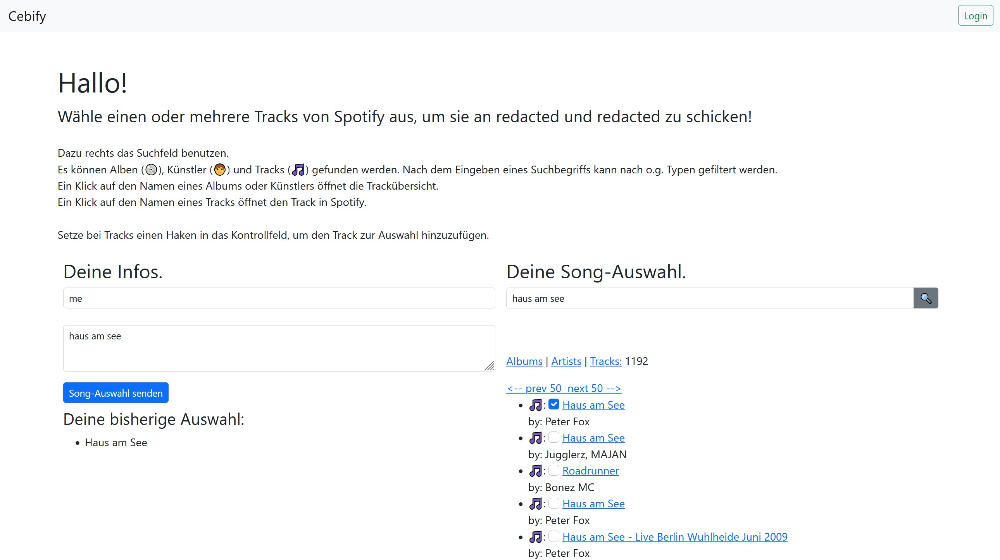

# Cebify

simple Spotify API Client that allows guests to submit songs which then can be compiled into a playlist and saved in the DJs account.

DJs are set in the mysql table `users` with their Spotify account ID.

Guests can submit without an Account.

